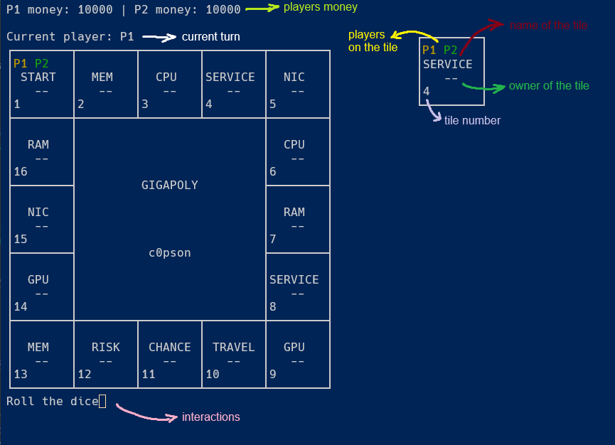
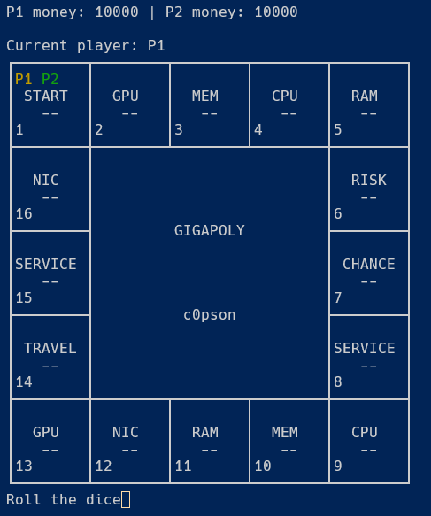
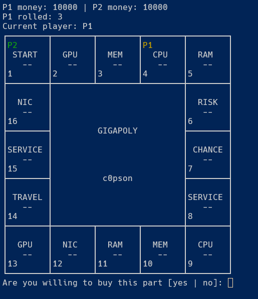
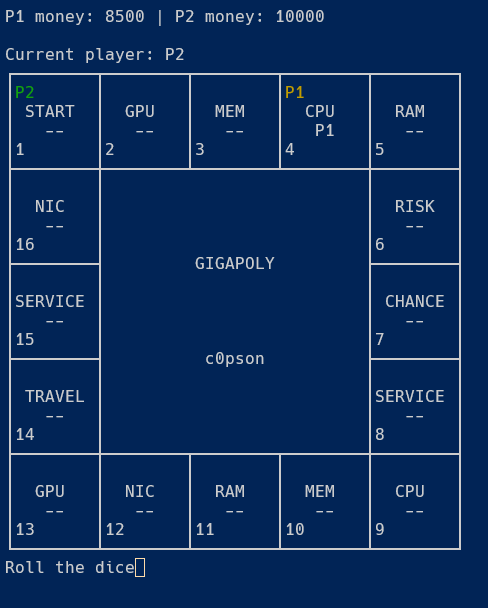
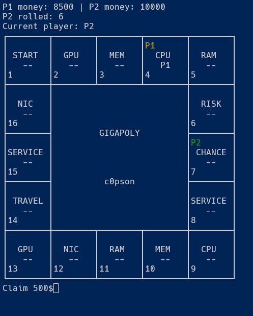
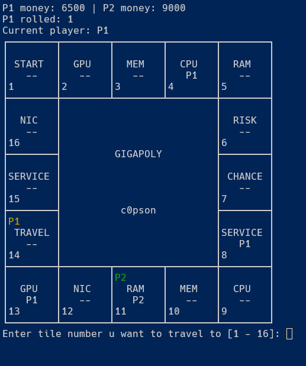
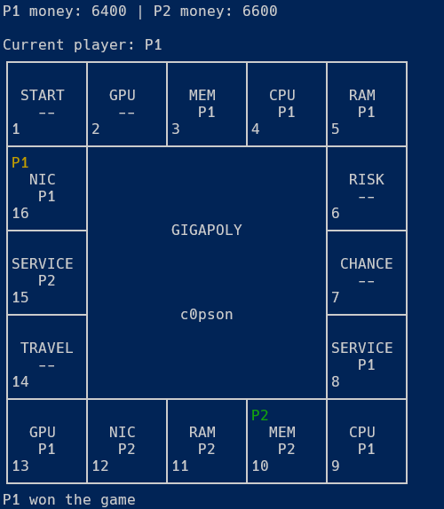

# GIGAPOLY

Console monopoly like game from Gigathon.

### How to run

Clone the repo and create virtual environment

```bash
git clone https://github.com/c0pson/Gigapoly
cd Gigapoly
python -m venv .venv
```

Activate virtual environment and run Gigapoly

- Windows:

```bash
.venv\Scripts\Activate.ps1
python .\src\main.py
```

- Unix:

```bash
source .venv/bin/activate
python src/main
```

### How to play

<center>



</center>

UI consists of players money, current turn, board, interaction/notification.
Each tile has:
 - place for the `pawns` (`P1 P2`)
 - name
 - owner indicator
 - tile number

<center>



</center>

Both players starts with 10000$. Player 1 `[P1]` starts the game. To roll the dice player has to press enter when `Roll the dice` is displayed under the board. This will throw the dice and move the player by the drawn number.

<center>



</center>

If player lands on tile without an owner there will be question whether player wants to buy pc part/service or not. To buy the ownership to the tile player has to type `yes`, `no` to skip and press enter. 

<center>



</center>

After buying ownership to the tile it will be displayed under the name of the tile.

<center>



</center>

If player lands on special tile `[CHANCE, RISK]` they have to press enter to claim the drawn effect.

<center>



</center>

If player lands on special tile `[TRAVEL]` they have to enter the number of the tile they want to go and press enter to travel to this specific tile. If tile has no owner player can but it or if tile is special tile they will obtain random effect from the card deck. Notice that you cant go through `START` tile to obtain extra 1000$.

<center>



###### Player 1 got all 5 components [MEM, CPU, RAM, GPU, NIC] to build PC

</center>

Game ends if either one player has all 5 unique parts to build the PC, or one goes bankrupt.

## Documentation

Project is documented in source code.
